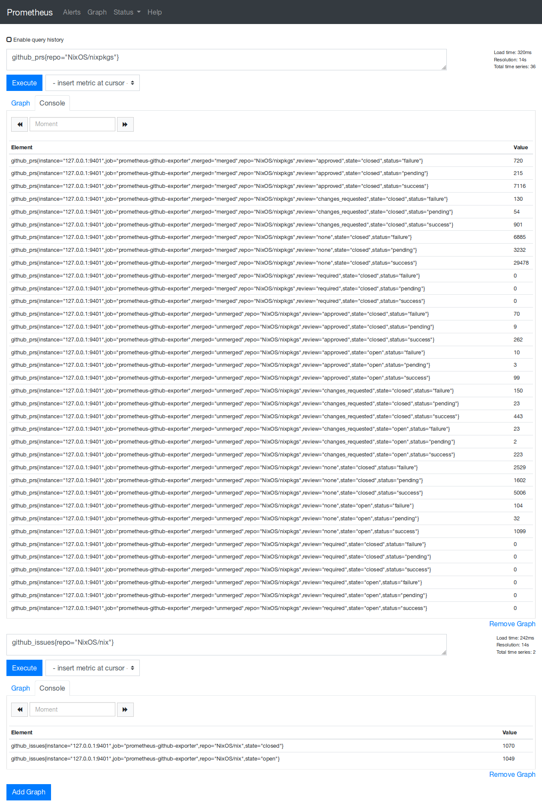

# GitHub Project Statistics Exporter

Scrape data about your project's issues and pull requests.

Captures quite a lot of data about your PRs in particular, with labels:

 - merged
 - review status
 - open/closed
 - status

and open/closed gauges for your issues.

Try out the data at:
https://status.nixos.org/prometheus/graph?g0.range_input=1h&g0.expr=github_prs&g0.tab=1&g1.range_input=1h&g1.expr=github_issues&g1.tab=1

